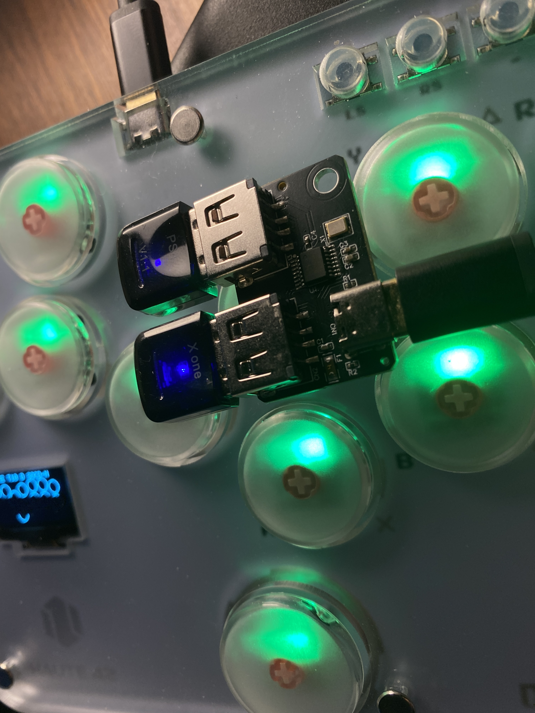
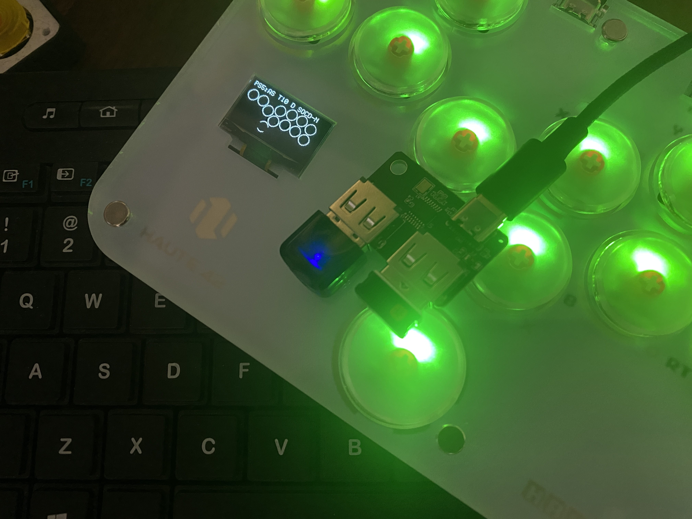

# Tiny USB Hub v1.2E

---

## Attribution

The following text must be included in any distribution of derivatives of this project or the boards. All links must also be included.

Based on the Tiny USB Hub by TheTrain.

Copyright © 2025 [TheTrain](http://x.com/thetrain24) 

[Licensed under CC BY 4.0](https://creativecommons.org/licenses/by/4.0/)

Changes from the original design:
  - list any changes you make here

Anyone selling this commercially must include in the listing that this is an open source item, link to the original repo and include the copyright as well as the link to my X account.

---

## Summary

The Tiny USB Hub is a small two port USB hub that can be used with GP2040-CE.  Currently the main uses for the USB hub are to connect two auth dongles (MagicBoots PS4 v1.1 + MagicBoots Xbox One) or connect a keyboard along with an auth dongle.

In the future we hope to expand out USB controller host add-on to allow for GP2040-CE to be used as a controller converter.

## Board design choices

This is a very simple board.  It has a small CH334R USB hub chip with a minimal implementation along with a USB-C in and two USB-A out.

## Assembly

These boards are designed to be made and assembled by JLCPCB.  As such, you will find a folder called `Hardware files` that contains a copy of the three files needed to have these boards made by JLCPCB.  

Those files are:
- A gerber file for the design of the board
- A BoM file for the list of parts to be assembled
- A PnP file for the placement of the parts in the BoM file

This design includes both SMD and through hole parts from JLCPCB.  There are additional costs associated with having through hole parts added to the board.  You can reduce overall costs by removing the USB A ports and soldering them yourself.  This can be done in EasyEDA directly by choosing to exclude the part from the BoM before exporting the necessary files.

These boards have been designed to be fully assembled by JLCPCB.  You will not need to do any soldering or assembly of any kind should you order a batch of them. 

It is possible to hand solder these boards, however the resistors and fuse on it may be tricky.  

Please note that we are not responsible for any issues that arise from the manufacturing of these boards done through JLCPCB or any other manufacturer.  These board files have been ordered and tested for functionality.  

## How to order a board

All of the boards so far have been ordered though JLCPCB.  Due to minimum order numbers you would get five of these basic breakout boards.  Here are the steps to make your first order and the options I chose along the way.

1 - Go to JLCPCB.com 
2 - Click on `Instant Quote` 
3 - Click on `Add Gerber file` and choose the file named `Gerber - Tiny USB Hub v1.2E.zip` 
4 - Choose the following options for the board: 
- Base Material = FR-4 
- Layers = 2 
- Dimensions = (should auto-populate) 22 * 34 mm 
- PCB Qty = 5 
- Product Type = Industrial/Consumer electronics 
- Deburring/Edge Rounding = Yes 
- Different Design = 1 
- Delivery Format = Single PCB 
- PCB Thickness = 1.6 
- PCB Color = (up to you) 
- Silkscreen = (defaults to white for all except white boards which is black) 
- Surface Finish = HASL(with lead) 
- Outer Copper Weight = 1oz 
- Via Covering = Tented 
- Min via hole size/diameter = 0.3mm/(0.4/0.45mm) 
- Board Outline Tolerance = +/- 0.2mm(Regular) 
- Confirm Production file = Yes (Note 1) 
- Mark on PCB = Remove 
- Flying Probe Test = Fully Test 
- Gold Fingers = No 
- Castellated Holes = No 
- Edge Plating = No 
- No advanced options 

5 - Choose the following options for the PCB assembly
- PCBA Type = Economic (note 2) 
- Assembly Side = Top Side 
- PCBA Qty = (however large your run will be, minimum of 2) 
- Tooling holes = Added by Customer 
- Confirm Parts Placement = Yes (note 5) 

Note 1 + 2 - This adds around $1 to the total cost of the order and is 100% worth doing as they will check the placement of all SMD parts and make any necessary changes or reach out if there are concerns.  I cannot stress enough that this is the best $1 you will spend for the piece of mind of not messing up an entire batch.

6 - Make sure you have read the terms and conditions of JLCPCB assembly service and then click on the `Confirm` button if you agree  

7 - The Bill of Materials page will show you a render of the board without parts.  You can click the `NEXT` button here unless you see any issues with the board 

8 - You will now have the option to upload two files:
- For the `Add BOM File` you will need to choose the `BOM - Tiny USB Hub v1.2E.csv` file that is located in the Hardware files folder
- For the `Add CPL File` you will need to choose the `CPL - Tiny USB Hub v1.2E.csv` file that is located in the Hardware files folder 
Once these two files have been uploaded you can press the `Process BOM & CPL` button.

9 - You will now see a list of components that will be used to assemble the boards.  If there are not listed issues here you can click on the `NEXT` button. (note 3), (note 4)

Note 3 - You can also use this page to omit parts from the assembly.  This can primarily be used to omit specific parts like the USB A sockets.  Please only do this if you understand what you are doing as omitting main parts of the design will lead to non-functioning boards.  We are not responsible for any non-functional boards. 

Note 4 - We have spent extensive time to ensure that the parts chosen will work for this board.  If there are any parts that are out of stock, or you get warnings about anything, we would recommend you not proceed unless you understand how to find replacement parts.  If you are unsure, please feel free to join the Discord and ask us.  It is not uncommon for JLCPCB to have part shortages.  Most of the parts listed here come back in stock in a few days.  If that is the case, you may need to wait to place your order until all needed parts are in stock.

10 - There will now be a render of the board with parts on the Component Placements page.  Check this page to make sure that all parts are in the correct spots and orientation.  We have ordered based on these files before and they are known good.  If all looks well press the `NEXT` button. (note 5)

Note 5 - Please note that we are not responsible for boards made by JLCPCB or any other manufacturer that do note work.

11 - The quote & order page will give you a breakdown of the costs associated with the boards and assembly parts based on the quantity you have chosen. This does not include shipping.  Shipping will be calculated at a further step. 
- For Product Description I typically choose `Other` `Other` and type in `Controller board`.

If all looks well here you can click on the `SAVE TO CART` button.

12 - The `Secure Checkout` process will be different based on your location in the world.  We recommend researching your shipping options to choose the one that is right for your application. 

## Donations

Every part of this project is open source: from the GP2040-CE firmware, to the original Pico Fighting Board design, to this RP2040 Advanced Breakout Board design.  

Donations are not necessary but always welcome!  All received donations will be split evenly between TheTrain and N-I-X.  TheTrain will typically use donations to pay for Discord boosts and try out new designs or sending boards to people for testing, iterations and helping people get board setups that might not be in an economic position to get one themselves.

https://www.paypal.com/donate/?hosted_button_id=2JMTZVCGLDYC2

## Revision History

v1.2
- Moved to CH334R USB hub chip (first batch that works)

v1.1
- Changed to FE1.1 USB hub chip (did not work, incorrectly traced board)

v1.0
- Initial design (did not work, incorrectly traced board)

## Acknowledgments

- [TheTrain](https://github.com/TheTrainGoes) for doing the board design
- Everyone that works on the GP2040-CE project to make it the best controller firmware around